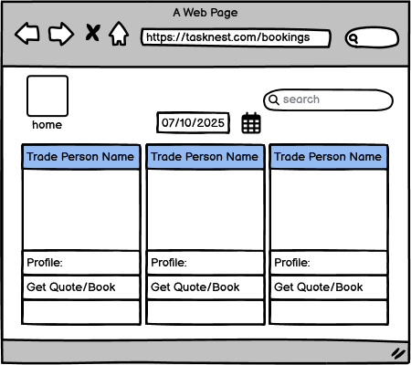
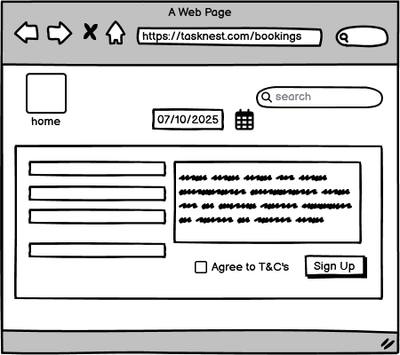
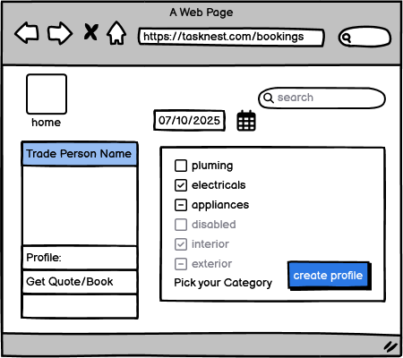
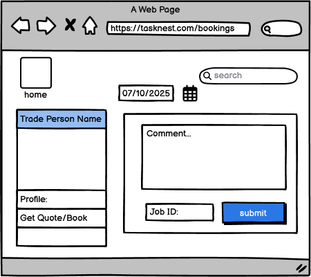
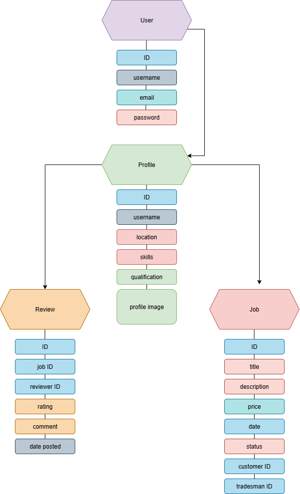

# TaskNest

## Project Overview
TaskNest is a full-stack web platform that connects customers with local tradesmen. 
Customers can book services, leave reviews, and find trusted professionals. 
Tradesmen can create profiles showcasing their skills and qualifications.

## User Stories
*(Add your user stories here)*

## Planning
- Wireframes
## Wireframes

Below are the initial wireframes created for TaskNest.

### Home Page

### Tradesman Profile Page

### Booking Page

### Login and Register Page

### Dashboard Page

### Ad Listing Page

### Review Page

- ERD (Data Model)

## Data Model (ERD)

The following diagram shows the relationships between the main entities in TaskNest.

## Project Development Board

You can track the ongoing development, tasks, and progress for **TaskNest** on the official GitHub Project Board below:

[View TaskNest Project Board](https://github.com/<your-username>/<your-repo>/projects)

The board outlines all current tasks, upcoming features, and completed milestones.

## Features

TaskNest is designed to connect customers with skilled tradesmen for quick and reliable service bookings.  
Below are the main features planned for development, separated into **MVP (Minimum Viable Product)** and **Stretch Goals**.

## Features

- User authentication (register, login, logout)
- Tradesmen can create and manage listings
- Customers can book and leave feedback
- Responsive design using Bootstrap
- **Database:** SQLite (chosen for MVP simplicity and Django integration)

---

### Minimum Viable Product (MVP)

| **Feature** | **Description** | **User Type** |
|--------------|-----------------|----------------|
| **User Authentication** | Users can register, log in, and log out securely using Django’s built-in auth system. | All Users |
| **Profile Management** | Tradesmen can create and edit their profiles, including their skills, qualifications, and location. | Tradesmen |
| **Service Listings** | Tradesmen can create, update, and delete job/service advertisements. | Tradesmen |
| **Booking System** | Customers can view listings and book tradesmen directly. | Customers |
| **Review and Rating System** | Customers can leave feedback and ratings on completed jobs. | Customers |
| **Admin Dashboard** | Admin can manage users, listings, and reviews through Django’s admin panel. | Administrator |
| **Responsive Design** | The site is mobile-friendly and works across different screen sizes. | All Users |

---

### Stretch Goals (Future Enhancements)

| **Feature** | **Description** | **User Type** |
|--------------|-----------------|----------------|
| **Dashboard View** | Users can view all their active bookings, jobs, and reviews in one place. | All Users |
| **Messaging System** | Allow customers and tradesmen to communicate directly through private messages. | All Users |
| **Search and Filter Options** | Search for tradesmen by skill, price, or location. | Customers |
| **Profile Badges** | Highlight top-rated tradesmen with achievement badges. | Tradesmen |
| **Booking Notifications** | Email or in-site notifications when a booking is confirmed or reviewed. | All Users |

---

### Summary

The MVP focuses on delivering a functional platform where customers can:
- Browse available tradesmen  
- Book jobs easily  
- Leave verified reviews  

Tradesmen can:
- Advertise their services  
- Manage bookings and reviews  

Future development will focus on improving communication, personalisation, and user experience.

## Technologies Used
- Python (Django)
- HTML, CSS
- PostgreSQL
- GitHub, Heroku

## Known Issues & Fixes
| **Issue** | **Cause** | **Fix** | **Status** | **Commit Message** |
|-----------|-----------|---------|------------|---------------------|
| `TemplateDoesNotExist: core/home.html` | Django couldn’t locate the template due to folder structure and missing template path in `settings.py` | Verified template location, added `core/templates` to `DIRS`, confirmed `INSTALLED_APPS` and `APP_DIRS` | Fixed | Fix: template loading issue, correct folder sturcture |
| CSS not loading (`404` on `home.css`) | Incorrect file name in template (`home.css` instead of `style.css`) | Updated `` path to match actual file name | Fixed | Fix: update static link to style.css |
|PostgreSQL connection failure during database setup. Django could not establish a connection due to “System Error 1067: The process terminated unexpectedly.”| PostgreSQL service could not start due to Windows permission conflicts in the Program Files directory and uninitialized data folder.| Switched the project database from PostgreSQL to SQLite by updating settings.py to use Django’s built-in sqlite3 engine. This ensured smooth local development with no external dependencies.| Resolved — Database running successfully using SQLite. All migrations applied and server running as expected.|Fix: replace PostgreSQL config with SQLite setup|
| Page rendering blank despite correct template path | incorrect import syntax: from django.shortcuts import render was mistyped as 'from django.shortcuts import import render' |  Corrected the import statement in views.py to properly load the render function | fixed | Fix: amend render request|
| Page not rendering after logic for signup | corrected statement| fixed| refactor: update class, update appropriate py files|
| django.db.utils.OperationalError: no such column: main_profile.location | Model field (location) was added to the Profile model after the initial migrations | Created and applied new migration to add the location field to the Profile table | Fixed |fix: resolved profile model migration issue and implemented dashboard view |
| Dashboard page not rendering after login | The dashboard.html template wasn’t located in the correct folder or Django couldn’t find it | Ensured TEMPLATES['DIRS'] points to the correct path and the template exists | fixed | |
| Styling not displaying| CSS/Bootstrap not yet linked to the templates | Deferred Bootstrap integration to later phase for consistent project structure | Deferred | |
|Profile not updating after form submission | Missing instance=profile in form save logic | Added instance binding to form in view | Fixed | feat: implemented profile editing feature with user validation |
| Users could access edit page without login | Missing @login_required decorator | Added login protection to edit_profile view | Fixed | feat: finish authentication system, update login logic, update appropriate templates and files |
| Add/Remove Job pages initially not rendering | Missing templates and URL routes | Created add_job.html and updated URLs in main/urls.py | Fixed | feat: implemented add/remove job functionality |
| Profile section missing details on dashbaord | Profile model fields not displaced in dashboard template | Added avatar, username, role, location, skills, and job stats display | Fixed  | Added profile info section with avatar, role, and job stats to dashboard; verified dashboard renders correctly |
| Needed realistic test data for development and testing | Empty database made it difficult to test CRUD functionality and user dashboards | Created Django management command `seed_profiles` to populate database with 3 tradesman and 3 customer profiles with realistic data | Fixed | feat: add seed_profiles management command for test data |
| Missing URL routes for add_job, remove_job, and add_review | Template references didn't match URL patterns | Added URL aliases and placeholder view for review functionality | Fixed | feat: add seed_profiles management command for test data |

## Testing
*(To be added later)*

## Deployment
*(To be added later)*
project board link:
https://github.com/users/Tafari-K/projects/6/views/1
## Credits
*(To be added later)*
