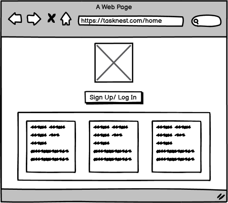
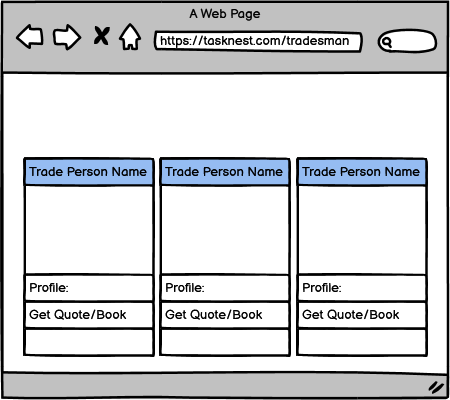
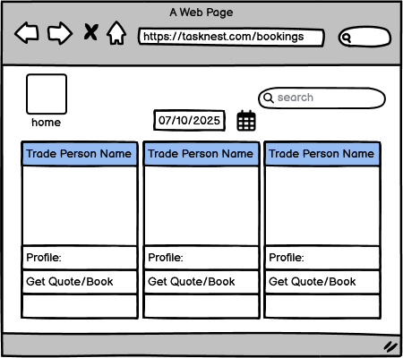
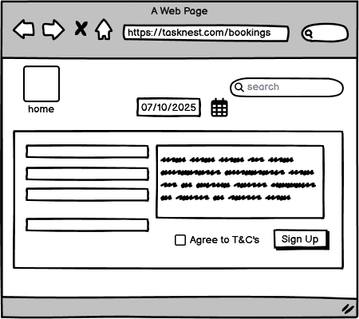
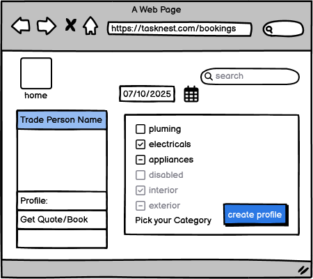

# TaskNest
## Contents
- [Project Overview](#project-overview)
- [User Stories](#user-stories)
- [Planning](#planning)
- [Wireframes](#wireframes)
- [Data Model (ERD)](#data-model-erd)
- [Project Development Board](#project-development-board)
- [Features](#features)
- [Summary](#summary)

## Project Overview
TaskNest is a job-matching platform designed to connect homeowners with skilled tradespeople in a simple, efficient, and trustworthy way. The platform aims to streamline the process of posting jobs, reviewing tradesmen, and managing ongoing work, all within a user-friendly interface.
### Main Audience
##### 1. Homeowners / Customers
Users who need work done in their homes repairs, installations, renovations, or maintenance.
They expect:
- A reliable way to find trustworthy tradespeople
- Clear job statuses
- Easy navigation and straightforward forms
- The ability to review and track work

##### 2. Tradesmen / Service Providers
Users offering skills such as plumbing, carpentry, electrics, painting, and general maintenance.
They want:
- A platform to find new work
- A dashboard to manage jobs
- A simple job creation and editing system
- Visibility to potential customers
### Technology Used
##### Django (Python Framework)
- Provides a robust backend with built-in user authentication
- Excellent for creating multi-role systems (customer vs tradesman)
- Offers secure handling of data, forms, and models
- Ensures rapid development with reusable components (templates, models, forms)

##### HTML, CSS, JavaScript
- Core technologies for clean, accessible UI development
- You maintain control over layout, styling, and responsiveness
- JavaScript enables dynamic elements such as dropdown logic, filtering, and job interaction

##### Bootstrap / Custom CSS
- Ensures fast, mobile-first responsive design
- Helps layout grids (like the 4×4 job cards) easily
- Reduces development time with pre-built components

##### SQLite / Postgres
- Ideal for structured data such as job listings, users, reviews, and dashboards
- Reliable and straightforward to integrate with Django ORM
- Reduces development time with pre-built components

### Accessibility Considerations

TaskNest was built with inclusivity and usability in mind, incorporating:

1. Clear Visual Hierarchy
- Legible font sizes
- Strong contrast between text and background
- Consistent spacing to allow easier scanning

2. Keyboard-Friendly Navigation
- Forms and menus can be navigated without a mouse
- Logical tab order
- Buttons and fields have clear focus indicators
3. Accessible Labels & ARIA
- Form fields include descriptive labels
- Status indicators (active/inactive jobs) are screen-reader compatible
- Icons include alt-text where needed

4. Responsive Design
- Fully functional on mobile, tablet, and desktop
- Ensures users can manage jobs on-the-go

## User Stories
#### Tradesmen User Stories
- As a tradesman, I want to create an account so that I can log in securely and manage my listings.
- As a tradesman, I want to build a profile showcasing my skills, qualifications, and experience so that customers can see my expertise.
- As a tradesman, I want to post service ads with descriptions, prices, and photos so that potential customers can book my services.
- As a tradesman, I want to edit or delete my listings so that I can keep my information up to date.
- As a tradesman, I want to view and manage my booking requests so that I can organise my schedule.
- As a tradesman, I want to view customer reviews on my services so that I can improve my reputation and performance.
#### Customer User Stories
- As a customer, I want to create an account so that I can make bookings and leave reviews.
- As a customer, I want to browse available tradesmen and filter by skill (e.g., plumber, electrician) so that I can quickly find the right professional.
- As a customer, I want to view a tradesman’s profile and previous reviews so that I can make an informed decision.
- As a customer, I want to book a service directly from the tradesman’s page so that I can easily arrange a job.
- As a customer, I want to leave a review and rating after a job is completed so that I can share my experience.
- As a customer, I want to edit or delete my own reviews in case I make a mistake.
- As a customer, I want to view my past bookings and their status so that I can keep track of work I’ve arranged.

## Planning
- Wireframes
## Wireframes

Before developing TaskNest, I created wireframes to map out the core layout, navigation paths, and user experience of the site. Each wireframe focused on clarity, ease of use, and aligning with the needs of both customers and tradespeople. Below is an overview of how each wireframe was intended to look, why the layout was chosen, and how the final build evolved with small improvements for usability and accessibility.

### Home Page


#### Initial Vision
The home page was designed to be clean, welcoming, and easy to understand at a glance.
It includes:
-  A large hero placeholder (for logo or imagery)
-  A clear Sign Up / Log In button
-  Three informational boxes explaining the platform

#### Why This Layout?
-  Minimal content means less cognitive load for first-time users
-  A centred CTA (Sign Up / Log In) encourages immediate engagement
-  Three columns allow quick scanning of benefits or features

#### Final Adjustments
- Simplified the copy to make it more readable
- Ensured the hero area resizes properly on mobile
- Added spacing and padding to improve accessibility & readability

### Tradesman Profile Page

#### Initial Intention

This page was meant for tradespeople to create or update their professional profile.
The wireframe included:
- A list of trade categories (checkboxes)
- Some categories intentionally disabled
- A Create Profile button

#### Why This Layout?
- Checkboxes give quick visual feedback
- Disabling unavailable categories communicates system constraints
- The page is intentionally minimal to avoid overwhelming the user

#### Final Adjustments
- Dynamic form improvements (fields now show/hide depending on occupation)
- Increased spacing between form elements
- Added clearer visual focus indicators for keyboard users

### Jobsboard Page

#### Initial Intention

The Jobs Board was planned as a central place where users could browse tradespeople or available jobs.
The wireframe included:
- A date selector
- A search bar
- Multiple tradesperson cards, each containing:
      - Name
      - Review rating
      - Action button (eg. Book Now)

#### Why This Layout?
- The grid layout makes scanning many profiles easy
- Card-based design avoids clutter and separates content cleanly
- Users can quickly search or filter

#### Final Adjustments
- Improved card responsiveness on mobile
- Strengthened borders and spacing for better visual separation
- Smoothed the search function and layout alignment

### Login and Register Page



### Dashboard Page

#### Initial Intention

The dashboard was envisioned as a tabbed interface allowing customers or tradespeople to manage their tasks.
Tabs included:
- Previous Jobs
- Upcoming Jobs
- Favourite Jobs

#### Why This Layout?
- Tabs keep information organised without overwhelming the user
- Switching between job categories is fast, intuitive, and reduces page reloads
- The large content box under the tabs was meant to display detailed job information

#### Final Adjustments
- More distinct active tab indicators
- Improved spacing and typography
- Ensured strong keyboard/tab-navigation compatibility

### Ad Listing Page

#### Initial Intention

The Ads Board was intended as a place where users could interact with individual listings, leave comments, or view job-specific details. The wireframe included:
- Tradesperson profile card
- A comment box
- Job ID input field
- Submit button

#### Why This Layout?
- The left panel gives context (who you're dealing with)
- The right panel focuses on the user action (comment or review)
- Simple, uncluttered structure that handles one task at a time

#### Final Adjustments
- Reorganised elements to improve spacing and clarity
- Updated form labels for accessibility
- Made the comment box fully responsive across different screen sizes

## Data Model (ERD)

The following diagram shows the relationships between the main entities in TaskNest.


## Project Development Board

You can track the ongoing development, tasks, and progress for **TaskNest** on the official GitHub Project Board below:

[View TaskNest Project Board](https://github.com/<your-username>/<your-repo>/projects)

The board outlines all current tasks, upcoming features, and completed milestones.


## Features

TaskNest is designed to connect customers with skilled tradesmen for quick and reliable service bookings.  
Below are the main features planned for development, separated into **MVP (Minimum Viable Product)** and **Stretch Goals**.

## Features

- User authentication (register, login, logout)
- Tradesmen can create jobs and manage listings
- Customers can create job ads and leave feedback
- Responsive design using Bootstrap
- **Database:** SQLite (chosen for MVP simplicity and Django integration)

### preset profiles
Below are details of the preset profiles created for testing and demonstration purposes:
Username: james_sparks | Password: TestPass123!
Username: sarah_fixes | Password: TestPass123!
Username: mike_carpenter | Password: TestPass123!

Customers:

Username: emma_wilson | Password: TestPass123!
Username: david_brown | Password: TestPass123!
Username: lisa_jones | Password: TestPass123!

### Minimum Viable Product (MVP)

| **Feature** | **Description** | **User Type** |
|--------------|-----------------|----------------|
| **User Authentication** | Users can register, log in, and log out securely using Django’s built-in auth system. | All Users |
| **Profile Management** | Tradesmen can create and edit their profiles, including their skills, qualifications, and location. | Tradesmen |
| **Service Listings** | Tradesmen can create, update, and delete job/service advertisements. | Tradesmen |
| **Booking System** | Customers can view listings and book tradesmen directly. | Customers |
| **Review and Rating System** | Customers can leave feedback and ratings on completed jobs. | Customers |
| **Admin Dashboard** | Admin can manage users, listings, and reviews through Django’s admin panel. | Administrator |
| **Responsive Design** | The site is mobile-friendly and works across different screen sizes. | All Users |

---

### Stretch Goals (Future Enhancements)

| **Feature** | **Description** | **User Type** |
|--------------|-----------------|----------------|
| **Dashboard View** | Users can view all their active bookings, jobs, and reviews in one place. | All Users |
| **Messaging System** | Allow customers and tradesmen to communicate directly through private messages. | All Users |
| **Search and Filter Options** | Search for tradesmen by skill, price, or location. | Customers |
| **Profile Badges** | Highlight top-rated tradesmen with achievement badges. | Tradesmen |
| **Booking Notifications** | Email or in-site notifications when a booking is confirmed or reviewed. | All Users |

---

### Summary

The MVP focuses on delivering a functional platform where customers can:
- Browse available tradesmen  
- Book jobs easily  
- Leave verified reviews  

Tradesmen can:
- Advertise their services  
- Manage bookings and reviews  

Future development will focus on improving communication, personalisation, and user experience.


## Technologies Used
- Python (Django)
- HTML, CSS
- PostgreSQL
- GitHub, Heroku

## Known Issues & Fixes
| **Issue** | **Cause** | **Fix** | **Status** | **Commit Message** / Outcome|
|-----------|-----------|---------|------------|---------------------|
| `TemplateDoesNotExist: core/home.html` | Django couldn’t locate the template due to folder structure and missing template path in `settings.py` | Verified template location, added `core/templates` to `DIRS`, confirmed `INSTALLED_APPS` and `APP_DIRS` | Fixed | Fix: template loading issue, correct folder sturcture |
| CSS not loading (`404` on `home.css`) | Incorrect file name in template (`home.css` instead of `style.css`) | Updated `` path to match actual file name | Fixed | Fix: update static link to style.css |
|PostgreSQL connection failure during database setup. Django could not establish a connection due to “System Error 1067: The process terminated unexpectedly.”| PostgreSQL service could not start due to Windows permission conflicts in the Program Files directory and uninitialized data folder.| Switched the project database from PostgreSQL to SQLite by updating settings.py to use Django’s built-in sqlite3 engine. This ensured smooth local development with no external dependencies.| Resolved — Database running successfully using SQLite. All migrations applied and server running as expected.|Fix: replace PostgreSQL config with SQLite setup|
| Page rendering blank despite correct template path | incorrect import syntax: from django.shortcuts import render was mistyped as 'from django.shortcuts import import render' |  Corrected the import statement in views.py to properly load the render function | fixed | Fix: amend render request|
| Page not rendering after logic for signup | corrected statement| fixed| refactor: update class, update appropriate py files|
| django.db.utils.OperationalError: no such column: main_profile.location | Model field (location) was added to the Profile model after the initial migrations | Created and applied new migration to add the location field to the Profile table | Fixed |fix: resolved profile model migration issue and implemented dashboard view |
| Dashboard page not rendering after login | The dashboard.html template wasn’t located in the correct folder or Django couldn’t find it | Ensured TEMPLATES['DIRS'] points to the correct path and the template exists | fixed | |
| Styling not displaying| CSS/Bootstrap not yet linked to the templates | Deferred Bootstrap integration to later phase for consistent project structure | Deferred | |
| Dashboard CSS not rendering on dashboard pages | Dashboard-specific stylesheet was not being applied due to incorrect load order and an earlier invalid `@import` in `style.css`; per-template links were inconsistent | Restored correct load order (`style.css` then `dashboard.css`), removed the invalid `@import` from `style.css`, added the proper `@import` in `dashboard.css` and temporarily included Bootstrap via CDN; updated dashboard templates to use Bootstrap grid to ensure presentable layout | Fixed | `fix: apply bootstrap styling to dashboards to resolve rendering issue.` — Deployed to Heroku; dashboards render correctly |
|Profile not updating after form submission | Missing instance=profile in form save logic | Added instance binding to form in view | Fixed | feat: implemented profile editing feature with user validation |
| Users could access edit page without login | Missing @login_required decorator | Added login protection to edit_profile view | Fixed | feat: finish authentication system, update login logic, update appropriate templates and files |
| Add/Remove Job pages initially not rendering | Missing templates and URL routes | Created add_job.html and updated URLs in main/urls.py | Fixed | feat: implemented add/remove job functionality |
| Profile section missing details on dashbaord | Profile model fields not displaced in dashboard template | Added avatar, username, role, location, skills, and job stats display | Fixed  | Added profile info section with avatar, role, and job stats to dashboard; verified dashboard renders correctly |
| Needed realistic test data for development and testing | Empty database made it difficult to test CRUD functionality and user dashboards | Created Django management command `seed_profiles` to populate database with 3 tradesman and 3 customer profiles with realistic data | Fixed | feat: add seed_profiles management command for test data |
| Missing URL routes for add_job, remove_job, and add_review | Template references didn't match URL patterns | Added URL aliases and placeholder view for review functionality | Fixed | feat: add seed_profiles management command for test data |
| No logout functionality visible to users | Logout route existed but no UI button in navigation | Added logout button to navbar with authentication check, updated logout redirect to home page | Fixed | feat: add logout button and active jobs preview page |
| Jobs page had minimal information display | Basic list view didn't show enough job details for users to make decisions | Redesigned jobs page with card layout, status badges, poster info, location, and interactive elements | Fixed | feat: add logout button and active jobs preview page |
| The jobs model was not showing in Django admin, even though it existed in the project. Attempted migrations showed "no changes detected". | There were two separate Django apps in the project core and main. Some model/admin files were accidentally left in core, while the actual logic used main. || Fixed | Verified that all important models, views, and admin registrations were in main. Removed the unused core app folder. Cleaned up INSTALLED_APPS in settings.py. Restarted the server and confirmed Jobs, Profiles, and Reviews now appear in Django admin.| 
|Images uploaded through Django admin were not displaying on the jobs page. A 404 error appeared when accessing image URLs. | MEDIA_ROOT and media URL routing were not properly configured. Images were uploaded via admin, but not served correctly due to missing URL patterns and folders.| |fixed | - Configured `MEDIA_ROOT` and `MEDIA_URL` in `settings.py`. Updated `urls.py` to serve media files during development using `static()`. Ensured `media/job_images/` directory exists and images are uploaded there.Re-uploaded images via Django admin. | Logout returned 405 error | Django’s `LogoutView` only allows POST requests, but navbar link used GET. | Replaced `<a>` link with a secure POST form including CSRF token. | ✅ Fixed | **Commit:** `fix: resolved logout 405 error and improved dashboard grid layout responsiveness`<br>Outcome: Logout now functions correctly and securely. |
| Avatar section stretched layout | Sidebar lacked width constraints and proper alignment on different screen sizes. | Wrapped avatar area in `.avatar-section`, added flexbox layout, centered elements, and improved styling for file input and upload button. | ✅ Fixed | Outcome: Avatar section now consistent and visually balanced across devices. |
| Job thumbnails misaligned on mobile | Dashboard cards didn’t have a defined grid structure, causing overlap or poor spacing. | Implemented `.thumb-grid` using `grid-template-columns` and added responsive media queries for mobile/tablet screens. | ✅ Fixed | Outcome: Dashboard layout now responsive, with properly aligned job cards. |
Django server failed to start `ModuleNotFoundError: No module named 'whitenoise'` | `whitenoise.middleware.WhtieNoiseMiddleware` was included in `MIDDLEWARE¬ but the Whitenoise package was not installed in the virtual environment | Installed Whitenoise using `pip install whitenoise` | Fixed |  Added: missing Whitenoise dependency to resolve WSGI load failure; server now start successfully|


## Testing
*(To be added later)*

## Deployment
in order to deploy this project to Heroku, the following steps were taken:
1. Created a `Procfile` and .python-version in the root directory with the following content:
   ```
   web: gunicorn tasknest_project.wsgi
   ```
   ```
    3.12
    ```
2. Added `gunicorn` , `whitenoise` and 'dj-database-url' to `requirements.txt`
   ```
3. git bash heroku ps:scale web=1
   ```
4. heroku run python manage.py migrate

5. create heroku app

the site can be found on heroku via the following link:
https://tasknest-eu-1d1de4a401f0.herokuapp.com/

## Project Development Board
project board link:
https://github.com/users/Tafari-K/projects/6/views/1
## Credits
### images
Tasknestlogo
https://www.canva.com/design/DAG5LJApSVo/--6PoxtA4Q59KThKgO5x-w/edit?ui=eyJHIjp7IkQiOnsiRCI6eyJBPyI6IkYifX19fQ
